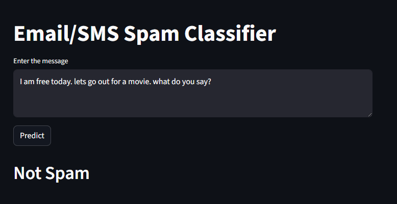

# Email / SMS Spam Classifier

A machine learning project that classifies SMS or email messages as **Spam** or **Not Spam** using Natural Language Processing (NLP) techniques and a Streamlit web application for inference.

---

## Overview

This project implements an end-to-end spam detection pipeline. It covers data preprocessing, feature extraction, model training, evaluation, and deployment through a Streamlit-based user interface.

The classifier is trained on the SMS Spam Collection dataset and uses TF-IDF features with a Multinomial Naive Bayes model to achieve reliable performance on text classification tasks.

---

## Dataset

- **Dataset:** [SMS Spam Collection](https://www.kaggle.com/datasets/uciml/sms-spam-collection-dataset)
- **Classes:**
  - `ham` → Not Spam (0)
  - `spam` → Spam (1)

### Data Preparation
- Removed irrelevant columns
- Renamed columns for clarity
- Encoded target labels using `LabelEncoder`
- Cleaned and normalized text data

---

## Text Preprocessing

The following preprocessing steps are applied during both training and inference:

1. Convert text to lowercase  
2. Tokenize text using NLTK  
3. Remove non-alphanumeric tokens  
4. Remove stopwords and punctuation  
5. Apply stemming using Porter Stemmer  

This ensures consistency between training and prediction pipelines.

---

## Feature Engineering

- Text data is converted into numerical form using **TF-IDF Vectorization**
- The trained vectorizer is saved and reused during inference

---

## Model

- **Algorithm:** Multinomial Naive Bayes
- **Reason:** Well-suited for text classification tasks using word frequency features
- **Evaluation Metrics:**
  - Accuracy
  - Precision (prioritized to minimize false positives)

---


## Streamlit Application

The Streamlit app allows users to enter an SMS or email message and receive an instant classification result.

### Prediction Flow
1. User inputs text
2. Text is preprocessed
3. TF-IDF vectorizer transforms input
4. Trained model predicts class
5. Result is displayed as **Spam** or **Not Spam**

---

## Ouput Examples

### Spam


### Not Spam

---


## How to Run the Project

### 1. Clone the Repository
```bash
git clone https://github.com/your-username/spam-classifier.git
cd spam-classifier
```

### 2. Create the virtual environment & run the app
```bash
python -m venv .venv
.venv\Scripts\activate
pip install -r requirements.txt

streamlit run app.py
```